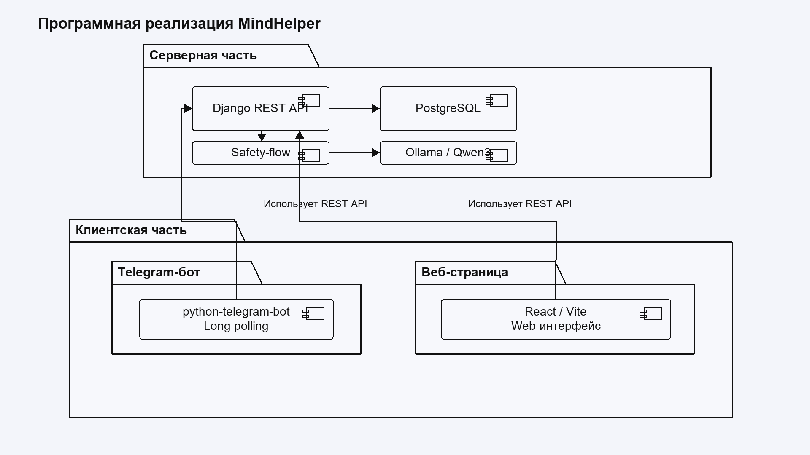
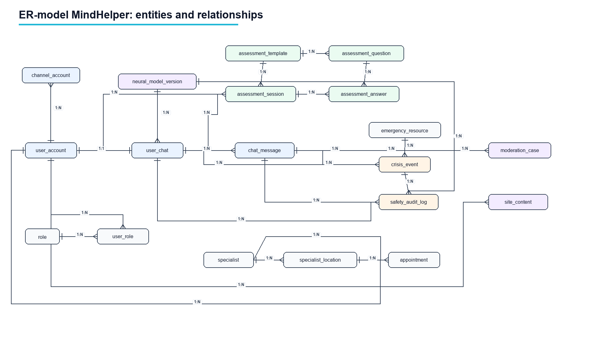

# MindHelper

MindHelper is a web service and Telegram bot for supportive question-answer interaction and preliminary psychological state screening. The project combines a React web interface, Django REST backend, PostgreSQL database, Telegram bot integration and a local Qwen model served through Ollama.

> The service is not a medical diagnostic tool and does not replace emergency care, a psychiatrist, psychotherapist or clinical psychologist. Safety logic is used to reduce harmful answers and route high-risk situations to emergency resources.

## Preview

### Program Architecture



### Database Model



## Main Features

- User registration and login for the web interface.
- Single persistent user chat with message history.
- Local neural model integration through Ollama and Qwen.
- Safety-flow for risk screening, crisis routing and response control.
- Emergency resources and specialist directory.
- Telegram bot that uses the same backend chat pipeline as the website.
- Django Admin for content, model versions, emergency resources and moderation.
- PostgreSQL schema with UUID identifiers.
- Automated tests for core backend components.

## Technology Stack

| Layer | Technology |
| --- | --- |
| Frontend | React, TypeScript, Vite |
| Backend | Python, Django, Django REST Framework |
| Database | PostgreSQL |
| LLM runtime | Ollama + Qwen |
| Bot | python-telegram-bot, long polling |
| Admin | Django Admin |
| Tests | pytest, pytest-django |

## Repository Structure

```text
MindHelper/
|-- backend/                  # Django backend
|   |-- apps/                 # Domain applications
|   |-- config/               # Django settings and URLs
|   |-- tests/                # Backend tests
|   |-- .env.example          # Safe local configuration template
|   `-- pyproject.toml
|-- frontend/                 # React/Vite frontend
|   |-- src/
|   |-- package.json
|   `-- vite.config.ts
|-- docs/
|   |-- db/sql/               # PostgreSQL schema and seed scripts
|   `-- thesis/diagrams/      # Architecture and ER diagrams
`-- README.md
```

## Backend Setup

```powershell
cd backend
..\.venv\Scripts\Activate.ps1
```

If the virtual environment does not exist yet:

```powershell
python -m venv ..\.venv
..\.venv\Scripts\Activate.ps1
python -m pip install -U pip
pip install -e ".[dev]"
```

Create local environment configuration:

```powershell
copy .env.example .env
```

Then fill local values in `backend/.env`:

- `DJANGO_SECRET_KEY`
- `POSTGRES_PASSWORD`
- `TELEGRAM_BOT_TOKEN`
- `LLM_OLLAMA_MODEL`

Do not commit `.env` or token files.

Run migrations:

```powershell
python manage.py migrate
```

Create an admin user:

```powershell
python manage.py createsuperuser
```

Start backend:

```powershell
python manage.py runserver
```

Backend URLs:

- API: `http://127.0.0.1:8000/api/v1/`
- Admin: `http://127.0.0.1:8000/admin/`

## Frontend Setup

```powershell
cd frontend
npm install
npm run dev
```

Frontend URL:

```text
http://localhost:5173
```

## Ollama / Qwen

Install and start Ollama, then pull the model used by the project:

```powershell
ollama pull qwen3:8b
ollama serve
```

In another terminal, activate the model version in the database:

```powershell
cd backend
..\.venv\Scripts\Activate.ps1
python manage.py activate_ollama_model
```

The backend expects Ollama at:

```text
http://127.0.0.1:11434
```

## Telegram Bot

Create a bot with BotFather and put the token into `backend/.env`:

```env
TELEGRAM_BOT_TOKEN=replace-me
```

Configure bot commands:

```powershell
cd backend
python manage.py configure_telegram_bot
```

Run bot worker:

```powershell
python manage.py run_telegram_bot
```

The bot uses long polling, so a public webhook server is not required for local development.

## Tests

```powershell
cd backend
pytest
```

If temporary folders like `pytest-cache-files-*` appear, they can be deleted. They are generated by test execution and are ignored by Git.

## Database Scripts

The current PostgreSQL schema and seed data are stored here:

- `docs/db/sql/01_schema.sql`
- `docs/db/sql/02_seed.sql`

The Django models and migrations are the main source of truth for application development.

## Security Notes

- Never commit `.env`, real Telegram tokens, API keys or private certificates.
- `backend/.env.example` is only a safe template.
- Local files like `Telegram_Api.txt` must stay outside Git.
- The LLM is constrained by safety-flow, crisis-event logging and emergency-resource routing.
- The project is intended for preliminary support scenarios, not clinical diagnosis.

## Useful Commands

Run backend:

```powershell
cd backend
..\.venv\Scripts\Activate.ps1
python manage.py runserver
```

Run frontend:

```powershell
cd frontend
npm run dev
```

Run Telegram bot:

```powershell
cd backend
..\.venv\Scripts\Activate.ps1
python manage.py run_telegram_bot
```

Run tests:

```powershell
cd backend
pytest
```
