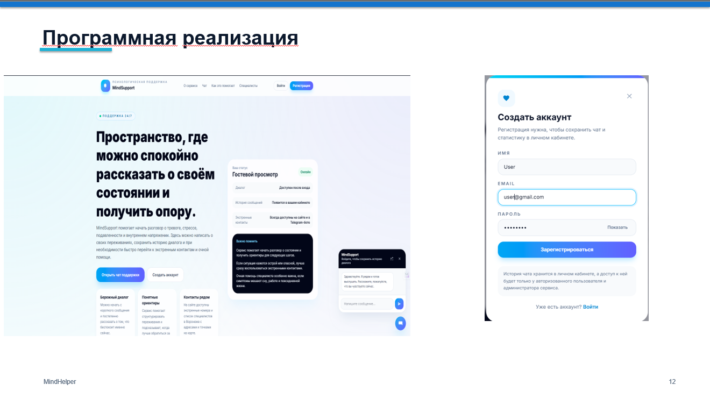
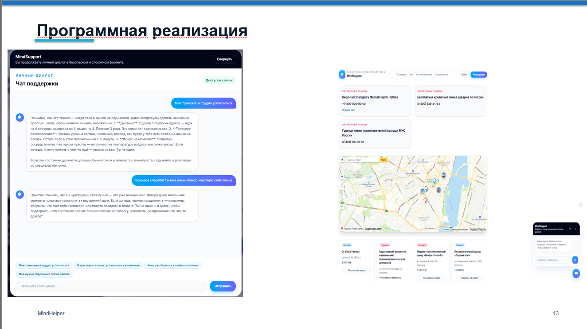

# MindHelper

MindHelper — прототип вопросно-ответной системы для предварительной психологической диагностики и поддержки пользователя на основе нейросетевой модели. Проект объединяет веб-интерфейс, Telegram-бота, серверную часть на Django, базу данных PostgreSQL и локальный запуск LLM через Ollama/Qwen.

Сервис задуман как безопасная точка первого контакта: пользователь может описать свое состояние, получить бережный ответ, простые рекомендации самопомощи, экстренные контакты и информацию о специалистах. Система не ставит медицинский диагноз и не заменяет обращение к врачу, психологу, психотерапевту или экстренным службам.

## Интерфейс

### Главная страница и регистрация



### Чат поддержки, экстренные контакты и карта специалистов



## Основная идея

MindHelper решает задачу предварительной поддержки пользователя в ситуациях тревоги, стресса, эмоционального напряжения и неопределенности. Ключевая цель проекта — не заменить специалиста, а помочь человеку быстрее сформулировать проблему, получить безопасный первичный ответ и при необходимости перейти к более надежному сценарию помощи.

В основе проекта лежит единый серверный контур: сайт и Telegram-бот обращаются к одной базе данных, одному сервису обработки сообщений и одной нейросетевой модели. Благодаря этому история диалога, кризисные события, справочная информация и версии модели хранятся централизованно.

## Возможности

- Веб-чат поддержки с сохранением истории сообщений для зарегистрированного пользователя.
- Telegram-бот, работающий как дополнительный канал общения с тем же backend-контуром.
- Интеграция локальной нейросетевой модели Qwen через Ollama.
- Safety-flow для выявления потенциально опасных сообщений и ограничения вредных ответов.
- Уровни риска: `low`, `elevated`, `high`, `critical`.
- Фиксация кризисных событий в базе данных для последующего анализа и аудита.
- Справочник экстренных ресурсов, включая горячие линии психологической помощи.
- Каталог специалистов и организаций с адресами, ценами и отображением на карте.
- Django Admin для управления моделями, контентом, специалистами, экстренными ресурсами и служебными данными.
- PostgreSQL-схема с UUID-идентификаторами и связанной доменной моделью.
- Набор backend-тестов для проверки ключевой бизнес-логики.

## Архитектура


Проект разделен на клиентскую и серверную части. Клиентская часть реализована на React и TypeScript, серверная часть — на Django и Django REST Framework. PostgreSQL используется как основное хранилище данных, а Ollama обеспечивает локальный запуск Qwen-модели без передачи пользовательских сообщений внешнему LLM-провайдеру.

Общая логика обработки сообщения выглядит так:

1. Пользователь отправляет сообщение через сайт или Telegram.
2. Backend сохраняет пользовательское сообщение в `chat_message`.
3. Safety-контур оценивает текст и определяет уровень риска.
4. При необходимости создается запись `crisis_event` и выбирается сценарий эскалации.
5. Для допустимого сценария формируется запрос к Qwen через Ollama.
6. Ответ модели проходит ограничения policy-layer и сохраняется в истории чата.
7. Пользователь получает ответ, а администратор может анализировать события через Django Admin.

## Модель данных


База данных сгруппирована вокруг нескольких смысловых блоков:

| Блок | Назначение |
| --- | --- |
| Пользователи и роли | Хранение аккаунтов, ролей и внешних каналов связи пользователя. |
| Чат | Хранение единого пользовательского диалога и всех сообщений. |
| Нейросеть | Учет используемых версий модели и параметров интеграции. |
| Safety-flow | Регистрация кризисных событий, уровней риска и маршрутов обработки. |
| Опросники | Шаблоны, вопросы, сессии прохождения и ответы пользователя. |
| Справочник помощи | Экстренные контакты, специалисты, организации и адреса на карте. |
| Администрирование | Управление пользовательским контентом и служебной информацией. |

Ключевая сущность пользовательского сценария — `user_chat`: она связывает пользователя, сообщения, выбранную версию нейросети, результаты оценки риска и дополнительные диагностические сессии. Такой подход позволяет не создавать отдельную логику для сайта и Telegram-бота, а использовать общий сервис обработки сообщений.

## Нейросетевая часть

В проекте используется локальная LLM-модель семейства Qwen, запускаемая через Ollama. Такой вариант выбран из-за трех причин: возможность локального запуска, отсутствие зависимости от закрытого API и достаточное качество генерации русскоязычных ответов для прототипа вопросно-ответной системы.

Нейросетевая часть не ограничивается прямым вызовом модели. Перед генерацией и после нее применяется дополнительная серверная логика:

- подготовка системного промпта с правилами безопасного поведения;
- передача части истории диалога для сохранения контекста;
- определение риска пользовательского сообщения до ответа модели;
- запрет на медицинские назначения, диагнозы и опасные инструкции;
- замена ответа на кризисный сценарий при критическом уровне риска;
- сохранение версии модели, участвующей в генерации ответа.

Полноценное дообучение модели рассматривается как перспективный этап. В текущей реализации основной акцент сделан на более реалистичный и контролируемый путь улучшения: prompt-policy, red-team сценарии, safety-evaluation, расширение корпуса опасных и пограничных примеров, а затем возможное LoRA/fine-tuning на проверенном датасете.

## Safety-Flow

Safety-flow — это программный контур, который снижает вероятность вредного ответа нейросети. Он не полагается только на саму LLM, а добавляет отдельный слой правил, маршрутизации и аудита.

В текущей логике учитываются следующие ситуации:

- прямые и косвенные формулировки суицидального риска;
- намерение причинить себе вред;
- высокая эмоциональная дезорганизация;
- просьбы о медицинских назначениях или опасных действиях;
- сообщения, требующие показа экстренных контактов;
- ответы модели, которые не должны содержать диагнозы, лекарства или инструкции вреда.

Для кризисных сообщений создается запись `crisis_event`, где фиксируются уровень риска, статус обработки, код маршрута и необходимость последующего анализа. Это делает safety-логику не просто набором условий в коде, а частью проверяемой архитектуры проекта.

## Telegram-Бот

Telegram-бот реализован как отдельный канал доступа к сервису. Он не содержит полностью независимой логики консультаций, а обращается к тем же backend-сервисам, что и сайт. Это важно для целостности системы: обработка сообщений, safety-flow, история диалога и экстренные ресурсы остаются едиными.

В боте предусмотрены базовые пользовательские команды, приветственное сообщение, обращение к чату поддержки и получение справочной информации из базы данных. Такой подход позволяет расширять Telegram-канал без дублирования бизнес-логики.

## Администрирование

Административная часть построена на Django Admin. Через нее можно управлять справочной и служебной информацией проекта:

- версиями нейросетевой модели;
- экстренными контактами;
- специалистами и организациями;
- адресами и координатами для карты;
- пользовательскими аккаунтами и ролями;
- сообщениями, кризисными событиями и safety-аудитом;
- контентными блоками сайта.

Админка нужна не только для технического обслуживания, но и для быстрой актуализации данных без прямого изменения базы через SQL.

## Технологический стек

| Уровень | Технологии |
| --- | --- |
| Frontend | React, TypeScript, Vite |
| Backend | Python, Django, Django REST Framework |
| База данных | PostgreSQL |
| Нейросетевая модель | Ollama, Qwen |
| Telegram | python-telegram-bot, long polling |
| Администрирование | Django Admin |
| Тестирование | pytest, pytest-django |
| Документация | PlantUML, Markdown, DOCX-материалы диплома |

## Структура репозитория

```text
MindHelper/
|-- backend/                  # Django backend и доменные приложения
|   |-- apps/                 # accounts, chat, neural_engine, directory и др.
|   |-- config/               # настройки Django и маршрутизация
|   |-- tests/                # backend-тесты
|   |-- .env.example          # безопасный пример локальной конфигурации
|   `-- pyproject.toml
|-- frontend/                 # React/Vite frontend
|   |-- src/                  # компоненты, API-клиент, страницы
|   |-- package.json
|   `-- vite.config.ts
|-- docs/
|   |-- assets/               # изображения для README
|   |-- db/sql/               # SQL-схема и тестовые данные
|   `-- thesis/               # материалы дипломной работы и диаграммы
|-- .gitignore
`-- README.md
```

## Безопасность данных

В репозиторий не должны попадать реальные токены, пароли, локальные `.env`-файлы, временные кеши тестов и системные файлы IDE. Для этого подготовлен `.gitignore`, а пример конфигурации вынесен в `backend/.env.example` без реальных секретов.

Особенно важно не публиковать:

- `TELEGRAM_BOT_TOKEN`;
- реальные пароли PostgreSQL;
- приватные API-ключи;
- локальные файлы с токенами;
- временные папки `pytest-cache-files-*`;
- `.venv`, `node_modules`, `.idea` и другие локальные артефакты.

## Статус проекта

Проект находится в состоянии функционального дипломного прототипа. Реализованы основные пользовательские сценарии: веб-интерфейс, регистрация, чат, Telegram-бот, интеграция с локальной нейросетью, справочник помощи, карта специалистов, административная панель, PostgreSQL-модель данных и safety-контур.

Дальнейшее развитие проекта может включать расширение red-team корпуса, улучшение качества классификации риска, сбор проверенного датасета, экспертную оценку ответов и постепенный переход к LoRA/fine-tuning при наличии достаточной методической базы.
