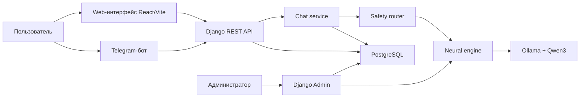
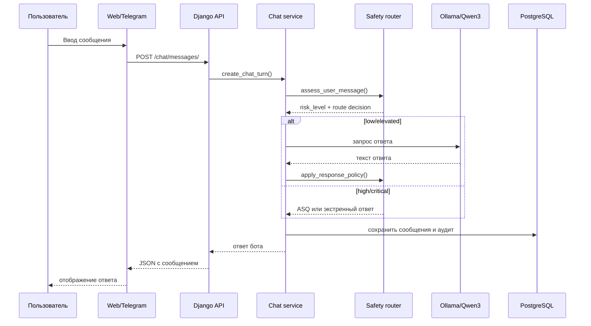
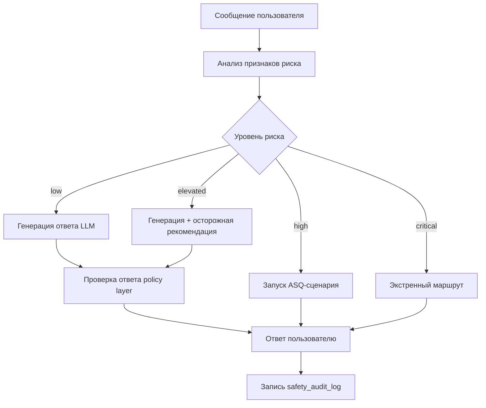
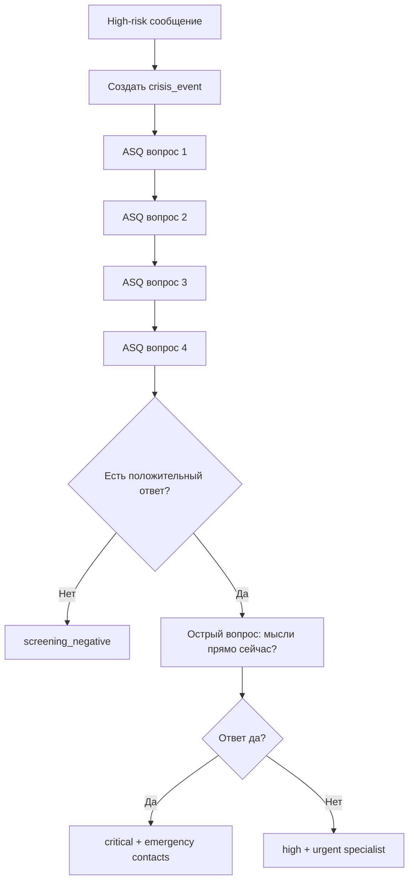

# Черновик дипломной работы. Часть 2

## 2 Модели и алгоритмы вопросно-ответной системы

В первой главе была обоснована необходимость не просто диалогового чат-бота, а системы, в которой нейросетевая генерация работает внутри проверяемого и управляемого контура безопасности. В данной главе рассматриваются архитектурные решения, модель данных, алгоритм обработки сообщений пользователя, интеграция языковой модели и маршрутизация кризисных сценариев.

### 2.1 Общая архитектура системы

Разрабатываемая система MindHelper построена как веб-сервис с дополнительным Telegram-каналом взаимодействия. Архитектура разделена на несколько уровней:

- клиентский уровень;
- серверный уровень;
- уровень хранения данных;
- нейросетевой контур;
- административный контур;
- safety-контур.

Такое разделение позволяет независимо развивать пользовательский интерфейс, API, базу данных, Telegram-бота и модуль работы с моделью. Общая структура представлена на рисунке 2.1.

Рисунок 2.1 - Общая архитектура сервиса MindHelper

Клиентский уровень включает веб-интерфейс и Telegram-бота. Веб-интерфейс реализуется на React/Vite и предназначен для полноценного пользовательского сценария: знакомство с сервисом, регистрация, вход, чат, просмотр каталога специалистов и информации о помощи. Telegram-бот нужен как более быстрый и привычный канал общения. Он не дублирует бизнес-логику, а использует общий backend, чтобы сообщения и safety-решения обрабатывались единообразно.

Серверный уровень реализован на Django и Django REST Framework. Django выбран как зрелый фреймворк для разработки веб-приложений, включающий ORM, механизм миграций, административную панель, middleware и систему аутентификации [10]. Django REST Framework используется для построения API, сериализации данных и организации доступа frontend к backend [11].

Уровень хранения данных реализован на PostgreSQL. PostgreSQL выбран из-за надежности, поддержки транзакций, развитой системы типов, JSON-полей и широкого применения в веб-приложениях [12]. Для идентификаторов ключевых сущностей используются UUID, что делает модель данных менее зависимой от последовательных числовых ключей.

Нейросетевой контур построен вокруг локального inference через Ollama. Такой подход позволяет запускать модель на пользовательской машине или сервере без обращения к внешнему коммерческому AI API. В текущей версии используется модель семейства Qwen3, сведения о котором опубликованы разработчиками Qwen [17]. При этом модель не получает полной автономии: ее ответ проверяется policy layer, а в кризисных сценариях свободная генерация отключается.

### 2.2 Сценарий работы пользователя

Основной пользовательский сценарий начинается с регистрации или входа в систему. После авторизации пользователь получает доступ к личному чату. В системе предусмотрен один основной чат на пользователя, что упрощает восприятие сервиса: пользователь не выбирает множество сессий, а продолжает единый диалог. При необходимости пользователь может локально очистить отображение или сбросить историю, но сама модель данных хранит сообщения в `chat_message`, пока они не удалены серверной логикой.

Сценарий обработки сообщения представлен на рисунке 2.2.

Рисунок 2.2 - Последовательность обработки пользовательского сообщения

Важной особенностью является то, что анализ риска выполняется до обращения к языковой модели. Если сообщение классифицируется как critical, система не запрашивает LLM для свободного ответа, потому что в такой ситуации требуется не творческая генерация, а заранее определенный безопасный маршрут. Если сообщение относится к low или elevated, модель может участвовать в формировании ответа, но результат дополнительно проверяется.

### 2.3 Модель данных

Модель данных проектировалась так, чтобы поддерживать не только чат, но и развитие сервиса как полноценной платформы. Поэтому в ER-модель включены учетные записи пользователей, каналы связи, чат, сообщения, кризисные события, экстренные ресурсы, опросники, специалисты, записи, версии модели и административные сущности.

Основные группы сущностей представлены в таблице 2.1.

Таблица 2.1 - Группы сущностей ER-модели

| Группа | Сущности | Назначение |
|---|---|---|
| Identity & Access | `user_account`, `role`, `user_role`, `channel_account` | Пользователи, роли и привязка внешних каналов |
| Chat & Safety | `user_chat`, `chat_message`, `crisis_event`, `safety_audit_log` | Диалог, сообщения, риск-события и аудит |
| Assessments | `assessment_template`, `assessment_question`, `assessment_session`, `assessment_answer` | Расширяемые стандартизированные опросники |
| Directory | `emergency_resource`, `specialist`, `specialist_location`, `appointment` | Экстренные контакты, специалисты, адреса и запись |
| Admin & Model | `neural_model_version`, `moderation_case`, `site_content` | Управление моделью, модерацией и контентом |

Использование отдельной сущности `channel_account` позволяет связать внутреннего пользователя с внешними каналами. Например, Telegram-пользователь имеет `external_user_id` и `external_chat_id`, но в остальной системе он все равно представлен как `user_account`. Это решение предотвращает дублирование логики: веб-чат и Telegram-бот используют один и тот же сервис обработки сообщений.

Сущность `user_chat` связана с пользователем отношением один к одному. Это отражает выбранную продуктовую модель: у пользователя есть один личный диалог с помощником. Все сообщения хранятся в `chat_message`. Каждое сообщение содержит роль отправителя, текст, время создания и оценку риска, если она применима.

Сущность `crisis_event` фиксирует ситуации, когда система обнаружила повышенный или критический риск. В ней хранятся уровень риска, статус события, ссылка на сообщение-триггер, ресурс экстренной помощи, статус скрининга, номер текущего ASQ-вопроса и ответы пользователя. Это позволяет не терять контекст при последовательном уточнении состояния.

Сущность `safety_audit_log` нужна для анализа решений системы. Она фиксирует route code, escalation action, human-review flag, примененную версию модели, признаки риска и факт вмешательства policy layer. Такой аудит важен для дипломной работы, потому что позволяет перейти от субъективной оценки «бот ответил хорошо/плохо» к проверяемой истории маршрутов.

Блок assessments оставлен расширяемым. Он позволяет подключать стандартизированные опросники, но не делает их единственным способом взаимодействия. Такое решение исправляет ограничение старого варианта проекта, где вся логика была фактически сведена к PHQ-9 и GAD-7. В текущей архитектуре опросники являются дополнительным инструментом, а основной сценарий строится вокруг живого диалога и safety-flow.

### 2.4 Нейросетевой контур

Нейросетевой контур отвечает за генерацию ответов на сообщения пользователя в сценариях, где свободная генерация допустима. В качестве провайдера используется Ollama. Ollama предоставляет локальный API для запуска и взаимодействия с языковыми моделями [16]. Это удобно для учебно-исследовательского проекта, потому что позволяет не зависеть от внешних платных API и не отправлять пользовательские сообщения стороннему сервису.

В текущей конфигурации используется модель Qwen3 через Ollama. Qwen3 относится к современным открытым языковым моделям и может использоваться для диалоговых задач [17]. При выборе модели учитывались следующие факторы:

- возможность локального запуска;
- поддержка русского языка на приемлемом уровне;
- доступность через Ollama;
- возможность дальнейшей замены на другую модель без изменения основной архитектуры;
- поддержка prompt-based ограничений.

Важным архитектурным решением является сущность `neural_model_version`. Она хранит тег версии, имя модели, провайдера, safety profile, признак активности, дату развертывания и администратора, который создал запись. Это позволяет документировать, какая модель использовалась при генерации ответов, и в дальнейшем сравнивать версии между собой.

Запрос к модели формируется не только из последнего сообщения пользователя. Система передает историю последних сообщений, системную инструкцию и режим ответа. Системная инструкция задает роль русскоязычного помощника психологической поддержки, запрещает диагнозы, лекарственные назначения, опасные советы, ложные гарантии и раскрытие внутренней логики. Дополнительно учитывается сценарий: тревога, усталость, сон, перегрузка, самопомощь, апатия или неопределенное состояние.

Таким образом, поведение модели регулируется на трех уровнях:

1. Предгенерационный уровень: safety-router решает, можно ли обращаться к LLM.
2. Уровень prompt policy: системная инструкция ограничивает стиль и содержание ответа.
3. Постгенерационный уровень: response policy проверяет готовый текст и заменяет его fallback-ответом при нарушении правил.

### 2.5 Safety-flow

Safety-flow является центральным элементом системы. Его задача — не допустить ситуацию, когда модель даст опасный, неуместный или клинически некорректный ответ. В отличие от обычной moderation-фильтрации, safety-flow не просто запрещает отдельные слова, а выбирает маршрут обработки сообщения.

Общая схема представлена на рисунке 2.3.

Рисунок 2.3 - Safety-flow обработки сообщения пользователя

Для определения риска используются правила и признаки. Система ищет не только прямые фразы, но и смысловые компоненты:

- суицидальная идеация;
- метод самоповреждения;
- намерение;
- срочность;
- подготовка;
- самореференция;
- контекст третьего лица;
- признаки тревоги, бессонницы, перегрузки.

Например, простое сообщение «мне очень тяжело» может относиться к elevated, потому что содержит эмоциональное напряжение, но не указывает на непосредственную угрозу. Сообщение «я сейчас пойду на рельсы» содержит срочность и метод, поэтому должно попадать в critical. Система не должна ждать, пока пользователь сформулирует фразу из заранее известного списка; она должна реагировать на сочетание признаков.

Таблица 2.2 показывает основные route code и действия системы.

Таблица 2.2 - Маршруты safety-flow

| Route code | Условие | Действие |
|---|---|---|
| `low_support` | Критических признаков нет | Обычный поддерживающий диалог |
| `elevated_support` | Тревога, перегрузка, бессонница, сильное напряжение | Ответ LLM с осторожным суффиксом |
| `start_screening` | High-risk признаки без immediate emergency | Запуск ASQ |
| `repeat_screening` | Пользователь не ответил да/нет в ASQ | Повтор вопроса |
| `screening_next_question` | ASQ продолжается | Следующий вопрос |
| `screening_negative` | ASQ завершен без подтверждения риска | Поддерживающий ответ |
| `screening_high` | Неострый положительный ASQ | Рекомендация срочной очной помощи |
| `screening_critical` | Острый положительный ASQ | Экстренные контакты |
| `immediate_emergency` | Метод, намерение, срочность или подготовка | Экстренный маршрут без LLM |

Такой подход позволяет формализовать поведение системы. В дипломе это важно: вместо размытого утверждения «бот понимает опасные ситуации» можно показать конкретные маршруты, признаки, действия и результат аудита.

### 2.6 ASQ-сценарий

ASQ Toolkit описывает краткий скрининг суицидального риска, состоящий из четырех базовых вопросов, а также дополнительных материалов и clinical pathways [2]. В MindHelper ASQ используется не как медицинская процедура, а как инженерный сценарий уточнения в high-risk случае. Это означает, что система не ставит диагноз и не делает клиническое заключение, но задает короткие вопросы для выбора безопасного маршрута.

Сценарий работает следующим образом:

1. Пользователь пишет сообщение с high-risk признаками.
2. Система создает `crisis_event` со статусом `pending`.
3. Пользователю задается первый ASQ-вопрос.
4. Ответы сохраняются в `screening_answers`.
5. Если пользователь отвечает неясно, система повторяет просьбу ответить «да» или «нет».
6. Если базовые вопросы не подтверждают риск, событие может быть закрыто как dismissed.
7. Если риск подтвержден, задается острый уточняющий вопрос о наличии мыслей прямо сейчас.
8. При положительном остром ответе система переводит событие в critical и показывает экстренные контакты.

Упрощенная схема приведена на рисунке 2.4.

Рисунок 2.4 - ASQ-сценарий в MindHelper

Главное преимущество такого решения — предсказуемость. В high-risk сценарии модель не импровизирует, а система следует заранее описанному маршруту. Это особенно важно в психологически чувствительной области, где «красивый» текст модели может быть менее ценным, чем правильное действие.

### 2.7 Аудит safety-решений

Аудит safety-маршрутов нужен для контроля качества и последующего анализа ошибок. В обычном чате достаточно сохранить сообщения, но в safety-critical системе необходимо понимать, почему был выбран конкретный маршрут. Поэтому в `safety_audit_log` сохраняются:

- пользовательский чат;
- сообщение;
- связанное кризисное событие;
- версия модели;
- уровень риска;
- route code;
- escalation action;
- human-review flag;
- признак генерации через модель;
- признак вмешательства policy layer;
- провайдер модели;
- сработавшие правила;
- пояснение действия.

Например, если пользователь написал фразу с непосредственным намерением причинить себе вред, в журнале будет зафиксирован route code `immediate_emergency`, escalation action `emergency_contacts`, human-review flag `true`, risk level `critical`. Если же пользователь описывает тревогу и усталость, но без признаков самоповреждения, будет создан route `elevated_support`, а модель сможет сгенерировать поддерживающий ответ.

Такой аудит важен по нескольким причинам. Во-первых, он помогает отлаживать правила. Во-вторых, позволяет строить статистику: сколько было elevated, high и critical сценариев. В-третьих, он создает основу для future human review, когда эксперт сможет анализировать спорные случаи. В-четвертых, аудит позволяет сравнивать разные версии модели и safety profile.

### 2.8 Методика улучшения нейросетевого поведения

Полноценное дообучение модели является желательным направлением развития, но не должно быть первым шагом. Без safety-контуров fine-tuning может только усилить уверенность модели, не решив проблему опасных ответов. Поэтому улучшение поведения модели предлагается выполнять поэтапно.

Первый этап — prompt engineering и policy layer. На этом этапе задаются системные инструкции, ограничения, сценарии ответа, запрет диагнозов, запрет медикаментозных рекомендаций и запрет опасных советов.

Второй этап — red-team корпус. Он должен включать большое количество сценариев, в которых пользователь прямо или косвенно описывает опасное состояние. В корпус должны входить не только точные фразы, но и переформулировки, сленг, неполные сообщения, сообщения с ошибками, третье лицо и двусмысленные ситуации.

Третий этап — offline evaluation. Система должна прогонять корпус сценариев и проверять:

- правильно ли определен уровень риска;
- не пропущен ли critical случай;
- не завышен ли риск в бытовом сообщении;
- не выдала ли модель опасный ответ;
- был ли выбран правильный route code.

Четвертый этап — расширение базы безопасных рекомендаций. Для low/elevated сценариев можно подключить RAG по проверенным материалам самопомощи. Это позволит модели давать более содержательные советы, не выдумывая факты.

Пятый этап — fine-tuning или LoRA. Он становится разумным только после того, как накоплен размеченный корпус и определены метрики качества. Иначе обучение будет дорогостоящим и слабо проверяемым.

Такой порядок соответствует safety-first подходу: сначала строится контур безопасности и оценки, затем улучшается генеративное поведение модели.

### 2.9 Выводы по второй главе

Во второй главе была описана архитектура вопросно-ответной системы MindHelper. Система включает веб-интерфейс, Telegram-бота, backend на Django, PostgreSQL, локальную LLM через Ollama, административную панель и safety-flow. Показано, что ключевым элементом является не сама нейросеть, а способ ее безопасного включения в программный контур.

Предложенная модель данных поддерживает пользователей, каналы связи, историю диалога, кризисные события, опросники, справочники помощи, версии модели и аудит. Safety-flow разделяет сообщения на low, elevated, high и critical, а для high-risk сценариев использует ASQ-подобный уточняющий маршрут. Для critical сообщений свободная генерация отключается, и система показывает экстренные контакты.

Таким образом, MindHelper проектируется как проверяемая и расширяемая платформа для предварительной психологической поддержки, где нейросетевая модель используется не автономно, а под контролем правил, маршрутизации и аудита.

