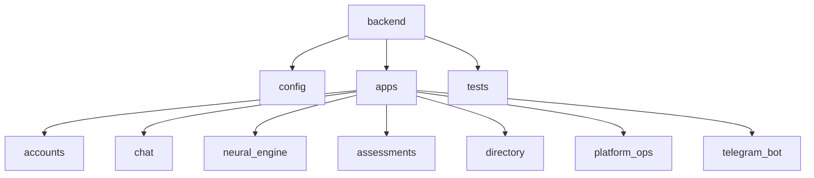

# Черновик дипломной работы. Часть 3

## 3 Программная реализация

В третьей главе рассматривается практическая реализация сервиса MindHelper. В отличие от раннего прототипа, основанного преимущественно на идее прохождения отдельных опросников, текущая реализация представляет собой модульную веб-систему с несколькими каналами взаимодействия, локальной языковой моделью, safety-контуром, административной панелью и тестируемой серверной архитектурой.

### 3.1 Выбор средств реализации

При выборе средств реализации учитывались следующие требования:

- возможность быстро разрабатывать и расширять backend;
- наличие ORM и миграций для работы с PostgreSQL;
- поддержка административной панели;
- удобная реализация REST API;
- возможность интеграции с frontend-приложением;
- возможность запуска отдельного Telegram-воркера;
- поддержка локальной LLM через HTTP API;
- пригодность проекта для автоматизированного тестирования.

Итоговый стек представлен в таблице 3.1.

Таблица 3.1 - Средства реализации проекта

| Компонент | Используемое средство | Назначение |
|---|---|---|
| Backend | Python, Django 5.2 | Серверная логика, ORM, миграции, админка |
| REST API | Django REST Framework | API для frontend и клиентских сценариев |
| База данных | PostgreSQL | Хранение пользователей, сообщений, событий, справочников |
| Frontend | React 19, Vite, TypeScript | Пользовательский веб-интерфейс |
| Telegram | Telegram Bot API | Канал общения через мессенджер |
| LLM runtime | Ollama | Локальный запуск языковой модели |
| Модель | Qwen3 через Ollama | Генерация поддерживающих ответов |
| Тестирование | pytest, pytest-django | Автоматизированные backend-тесты |
| Администрирование | Django Admin | Управление моделью, справочниками и аудитом |

Django выбран как основной backend-фреймворк, поскольку предоставляет встроенные средства для типовых задач веб-приложения: маршрутизация, работа с моделями, миграции, административная панель, аутентификация и middleware [10]. Django REST Framework дополняет Django средствами сериализации, permission-контроля и построения API [11].

PostgreSQL используется как основная база данных. Для проекта важны транзакционность, надежность, поддержка внешних ключей, индексов и JSON-полей. JSON-поля применяются, например, для хранения ответов ASQ-сценария и журналов Telegram-сообщений.

React и Vite выбраны для frontend, потому что позволяют быстро разрабатывать компонентный интерфейс, отделенный от backend. React ориентирован на построение пользовательских интерфейсов из компонентов [13], а Vite обеспечивает быстрый dev-сервер и сборку frontend-приложения [14].

### 3.2 Структура backend

Backend разделен на несколько Django-приложений. Такое разделение уменьшает связанность кода и делает структуру проекта удобной для сопровождения. Общая структура backend показана на рисунке 3.1.

Рисунок 3.1 - Структура backend-приложений

Приложение `accounts` отвечает за пользователей, роли и внешние каналы связи. Основная модель пользователя — `UserAccount`. Она наследует `AbstractBaseUser`, использует email как поле входа и хранит статус пользователя. Для ролей предусмотрены модели `Role` и `UserRole`. Для связи с Telegram используется `ChannelAccount`.

Приложение `chat` содержит основные сущности диалога: `UserChat`, `ChatMessage` и `CrisisEvent`. `UserChat` связан с пользователем отношением один к одному. `ChatMessage` хранит каждое сообщение, роль отправителя и риск-оценку. `CrisisEvent` фиксирует события повышенного риска и состояние ASQ-сценария.

Приложение `neural_engine` содержит логику работы с нейросетевым контуром:

- генерацию ответа через Ollama;
- построение system prompt;
- определение сценария сообщения;
- policy layer;
- safety routing;
- аудит маршрутов.

Приложение `directory` хранит справочную информацию: экстренные контакты, специалистов, адреса и записи. Для города Воронеж в базе могут быть заранее добавлены клиники или специалисты с координатами, чтобы frontend мог отображать их на карте.

Приложение `platform_ops` отвечает за административные сущности: версии модели, модерационные кейсы и контент сайта. Это позволяет обновлять информацию без изменения программного кода.

Приложение `telegram_bot` реализует отдельный процесс бота: получение обновлений через long polling, обработку команд, отправку сообщений и связывание Telegram-пользователя с внутренней учетной записью.

### 3.3 Реализация базы данных

База данных реализуется через Django ORM и PostgreSQL. Все основные сущности используют UUID как первичный ключ. Это решение было выбрано вместо автоинкрементных числовых идентификаторов, поскольку UUID лучше подходит для распределенных и расширяемых систем, где записи могут создаваться в разных контекстах.

ER-диаграмма системы приведена в приложении А. В тексте работы ее следует вставить как рисунок 3.2.

Рисунок 3.2 - ER-диаграмма базы данных MindHelper

Ключевым элементом является связь `user_account` -> `user_chat` -> `chat_message`. Благодаря ей система хранит полный диалог пользователя. Если пользователь взаимодействует через Telegram, его внешний идентификатор хранится в `channel_account`, но сообщения все равно попадают в общий chat service.

Отдельного внимания заслуживает `crisis_event`. Эта сущность нужна не для обычной истории сообщений, а для событий, требующих маршрутизации риска. В ней хранятся:

- уровень риска;
- статус события;
- ссылка на сообщение-триггер;
- ссылка на экстренный ресурс;
- статус скрининга;
- текущий номер вопроса;
- ответы скрининга;
- пояснение действия системы.

Для администраторского контроля и последующего анализа используется `safety_audit_log`. Эта таблица позволяет ответить на вопросы:

- какой маршрут выбрала система;
- почему он был выбран;
- использовалась ли модель;
- вмешалась ли response policy;
- требуется ли ручной просмотр;
- какая версия модели была активна.

Такой подход делает систему более прозрачной и пригодной для экспериментальной оценки.

### 3.4 Реализация API

API проектируется вокруг основных пользовательских сценариев. В таблице 3.2 приведены ключевые группы API-эндпоинтов.

Таблица 3.2 - Основные API-сценарии

| Группа | Назначение | Пример операции |
|---|---|---|
| Auth | Регистрация, вход, выход, текущий пользователь | Создать пользователя, получить сессию |
| Chat | Получение истории и отправка сообщения | `POST /api/v1/chat/messages/` |
| Directory | Получение экстренных ресурсов и специалистов | Список специалистов и адресов |
| Assessments | Работа с шаблонами и прохождениями опросников | Создать прохождение |
| Platform ops | Административные операции | Управление моделью и контентом |

Для отправки сообщения используется сервисный слой `create_chat_turn`. Он выполняет все основные действия:

1. Получает или создает чат пользователя.
2. Анализирует сообщение через policy.
3. Сохраняет пользовательское сообщение.
4. Проверяет наличие незавершенного ASQ-сценария.
5. Выбирает маршрут через `CrisisRoutingService`.
6. При необходимости обращается к LLM.
7. Проверяет ответ модели.
8. Сохраняет ответ бота.
9. Создает запись safety-аудита.

Вынос этой логики в сервисный слой важен для тестирования. API-view остается относительно простой, а критическая бизнес-логика проверяется отдельными тестами.

### 3.5 Frontend-интерфейс

Frontend реализован как React-приложение. Его задача — не показывать внутреннюю механику модели, а дать пользователю понятный сервис. Поэтому описание на сайте должно быть ориентировано на пользователя: поддержка, безопасный диалог, экстренные контакты, специалисты, приватность, Telegram-бот. В пользовательском интерфейсе не следует перегружать посетителя терминами вроде «route code» или «policy layer».

Основные пользовательские блоки:

- главная страница с описанием MindHelper;
- блок возможностей сервиса;
- регистрация и вход;
- чат поддержки;
- каталог специалистов;
- экстренные контакты;
- информация о Telegram-боте;
- состояния загрузки и ошибок.

В интерфейсе чата важно, чтобы история сообщений не очищалась самопроизвольно и корректно прокручивалась вниз при новых ответах. Это требование связано не только с удобством, но и с безопасностью: в психологическом диалоге предыдущие сообщения могут содержать важный контекст.

Пример пользовательского интерфейса чата нужно вставить как рисунок 3.3.

Рисунок 3.3 - Интерфейс веб-чата MindHelper

### 3.6 Telegram-бот

Telegram-бот реализован как отдельный процесс, запускаемый рядом с Django backend. Такой подход выбран потому, что polling Telegram API не должен смешиваться с процессом `runserver`. Telegram Bot API поддерживает получение обновлений через `getUpdates`, а также отправку и удаление сообщений [15].

Бот поддерживает команды:

- `/start` — начало работы;
- `/help` — список команд;
- `/privacy` — информация о данных;
- `/emergency` — экстренные контакты из базы данных;
- `/reset` — очистка сохраненной истории и попытка удалить последние сообщения бота.

При первом сообщении Telegram-пользователь связывается с внутренней учетной записью. Если такой пользователь уже существует, используется существующая запись `channel_account`. Если нет, создается новый `user_account` с техническим email вида `tg_<id>_<username>@telegram.local`.

Важное архитектурное решение состоит в том, что Telegram-бот не имеет отдельной логики генерации ответов. Он вызывает тот же `create_chat_turn`, что и веб-интерфейс. Поэтому safety-flow, crisis_event, audit log и модель работают одинаково для обоих каналов.

Пример работы Telegram-бота следует включить в работу как рисунок 3.4.

Рисунок 3.4 - Интерфейс Telegram-бота MindHelper

### 3.7 Административная панель

Django Admin используется как инструмент администратора. В рамках проекта администратор не является психологом, подключающимся к диалогу. Его роль техническая и операционная:

- обновление активной версии модели;
- проверка состояния Ollama;
- управление экстренными ресурсами;
- управление каталогом специалистов;
- редактирование контента сайта;
- просмотр кризисных событий;
- просмотр safety-аудита;
- модерация спорных сообщений.

Разделение ролей показано в таблице 3.3.

Таблица 3.3 - Роли пользователя и администратора

| Роль | Возможности | Ограничения |
|---|---|---|
| Пользователь | Регистрация, чат, Telegram-бот, просмотр помощи и специалистов | Не управляет моделью и справочниками |
| Администратор | Управление моделью, контентом, справочниками, аудитом | Не заменяет специалиста в диалоге |
| Система | Генерация ответов, safety-routing, аудит | Не ставит диагноз и не назначает лечение |

Административная панель особенно важна для `neural_model_version`. При смене модели администратор может добавить новую запись, указать provider, model name, version tag и safety profile. Это создает основу для дальнейшего сравнения моделей.

Скриншот административной панели управления моделью следует вставить как рисунок 3.5.

Рисунок 3.5 - Управление версиями модели в Django Admin

### 3.8 Интеграция локальной модели через Ollama

Интеграция с Ollama реализована через HTTP-запрос к локальному API. Backend формирует список сообщений, включающий системную инструкцию и историю диалога. Затем отправляет запрос к Ollama и получает ответ модели.

Преимущества локального запуска:

- контроль над данными;
- отсутствие зависимости от внешних AI API;
- возможность экспериментировать с разными open-source моделями;
- удобство для учебной работы;
- возможность фиксировать версию модели в базе.

Ограничения локального запуска:

- зависимость от мощности компьютера;
- ограниченная скорость генерации;
- необходимость подбирать размер модели под видеопамять;
- качество ответов может уступать крупным облачным моделям;
- требуется дополнительная safety-проверка.

В текущем проекте опыт запуска Qwen3-32B показал высокие требования к видеопамяти. Поэтому практическая интеграция была выполнена через более легкую модель Qwen3 в Ollama. Этот момент можно использовать в дипломе как инженерное обоснование: модель выбиралась не только по качеству, но и по возможности реального локального запуска на доступном оборудовании.

### 3.9 Реализация ограничений ответа

Ограничения ответа реализованы не только в system prompt, но и в post-processing. Это принципиально важно, потому что prompt сам по себе не является надежной защитой. Модель может нарушить инструкцию, особенно если пользователь задает провокационный или кризисный запрос.

Policy layer проверяет ответ на следующие классы ошибок:

- постановка диагноза;
- назначение лекарств;
- совет скрывать проблему;
- ложное обещание безопасности;
- поощрение самоповреждения;
- уход от экстренной маршрутизации;
- неполные и обрезанные предложения.

Если ответ нарушает правила, система заменяет его безопасным fallback-текстом. Для low/elevated сценариев fallback сохраняет поддерживающий характер. Для critical сценариев свободная генерация не используется.

### 3.10 Выводы по третьей главе

В третьей главе была описана программная реализация сервиса MindHelper. Реализация включает backend на Django и Django REST Framework, PostgreSQL, frontend на React/Vite, Telegram-бота, административную панель, локальную модель через Ollama и safety-контур.

Главным практическим результатом является то, что все каналы взаимодействия используют общий chat service. Это предотвращает дублирование логики и гарантирует единое применение safety-flow. Административная панель позволяет управлять моделью, справочниками и аудитом, а модульная структура backend делает проект удобным для тестирования и дальнейшего развития.

